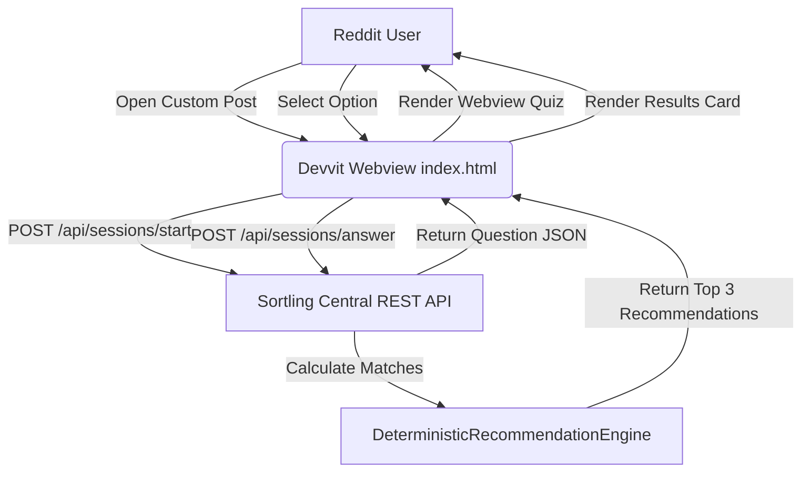

# Sortling Reddit App (`sorts-me/reddit`)

[](LICENSE)
[](https://www.typescriptlang.org)
[](https://developers.reddit.com)
[](https://sortling-bot.onrender.com)

> **Universal Reddit Devvit application for the Sortling campus guide ecosystem. Enabling students to take interactive club matching quizzes and browse verified campus directories directly within Reddit Custom Posts.**

**Sortling Reddit App** brings interactive campus club discovery to Reddit. Built with Reddit's Devvit SDK, webroot HTML5 webviews, and asynchronous REST API fallback handlers, it streams quiz questions and club recommendations inside subreddit feeds.

---

> [!NOTE]
> ## REDDIT DEVVIT ARCHITECTURE
>
> This repository contains the TypeScript Devvit application and HTML5 webview entrypoint (`webroot/index.html`). It connects to the central Sortling REST API (`https://sortling-bot.onrender.com/api/`) to execute recommendation queries.

---

## 🏛️ Devvit App Architecture



---

## 🌟 Key Features

* 📱 **Native Reddit Custom Posts**: Embeds interactive custom posts automatically on `AppInstall` or `AppUpgrade` events.
* ⚡ **High-Speed HTML5 Webview**: Clean, responsive UI styled with Sortling brand tokens (`#000543` background, `#ffffff` controls).
* 🔄 **Resilient REST API Fallback**: Connects to the central Sortling backend with graceful fallback handling for continuous uptime.
* 🎯 **Full Feature Parity**: Supports interactive multi-step matching quizzes, club detail lookups, and hackathon registries.
* 🛡️ **Devvit Menu Actions**: Subreddit moderator menu shortcut (`Create Sortling Campus Guide Post`) to generate custom posts on demand.

---

## 📂 Codebase Structure

* **`Devvit Entrypoint` ([main.ts](src/main.ts)):** Configures Reddit API triggers, installs custom post handlers, and defines moderator menu items.
* **`Webview Application` ([index.html](webroot/index.html)):** Single-page web app rendering Home, Quiz, Results, and Directory views with asynchronous fetch controllers.
* **`Configuration` ([devvit.json](devvit.json)):** Manifest specifying app permissions (Reddit API, HTTP), webroot entrypoints, and target subreddits.

---

## 🛠️ CLI Development & Deployment

1. Clone the repository and install dependencies:
   ```bash
   git clone https://github.com/sorts-me/Reddit.git
   cd Reddit
   npm install
   ```

2. Playtest locally on Reddit:
   ```bash
   npx @devvit/cli playtest r/sortling_dev
   ```

3. View live app logs:
   ```bash
   npx @devvit/cli logs r/sortling_dev --since 1h
   ```

4. Upload and publish new version to Reddit:
   ```bash
   npx @devvit/cli upload
   ```

---

## 📜 License

Licensed under the MIT License.
